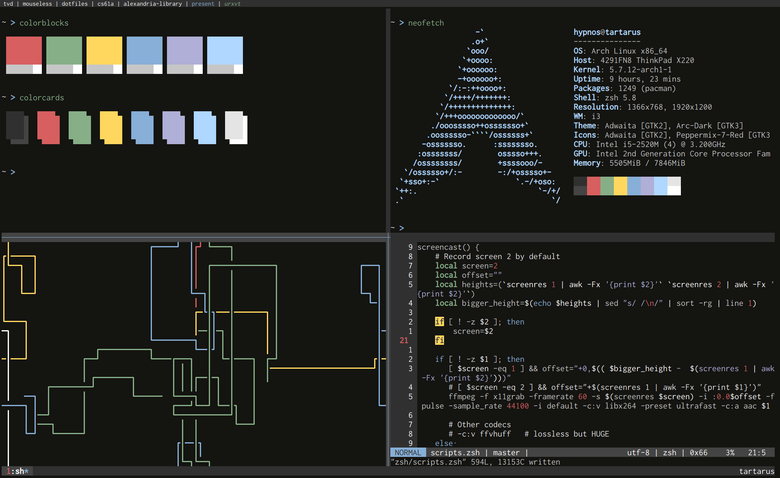

#  Doftiles

## What's in there?

My config for my Mouseless Development Environment.
I am using the lightweight and effective combo:

* arch linux
* i3 / dmenu / dunst
* Neovim
* tmux
* [zsh](https://thevaluable.dev/zsh-install-configure/) / [fzf](https://github.com/junegunn/fzf)
* git / [diff-so-fancy](https://github.com/so-fancy/diff-so-fancy)

All my config files are in this repository except:

* My development project configurations
* My config install settings

Those files are private and are on my private cloud (using [Nextcloud](https://nextcloud.com/)).

## WARNING

There are no backup system. If you install this on top of your dotfiles, expect a big mess.
You shouldn't use the `install.sh` script. You should only pick whatever you want and include it in your own config.

## Building Your Mouseless Development Environment

Switching between a keyboard and mouse costs cognitive energy. [My book will help you set up a Linux-based development environment](https://themouseless.dev) that keeps your hands on your keyboard. Take the brain power you've been using to juggle input devices and focus it where it belongs: on the things you create.

You'll learn how to write your own installation scripts too!
