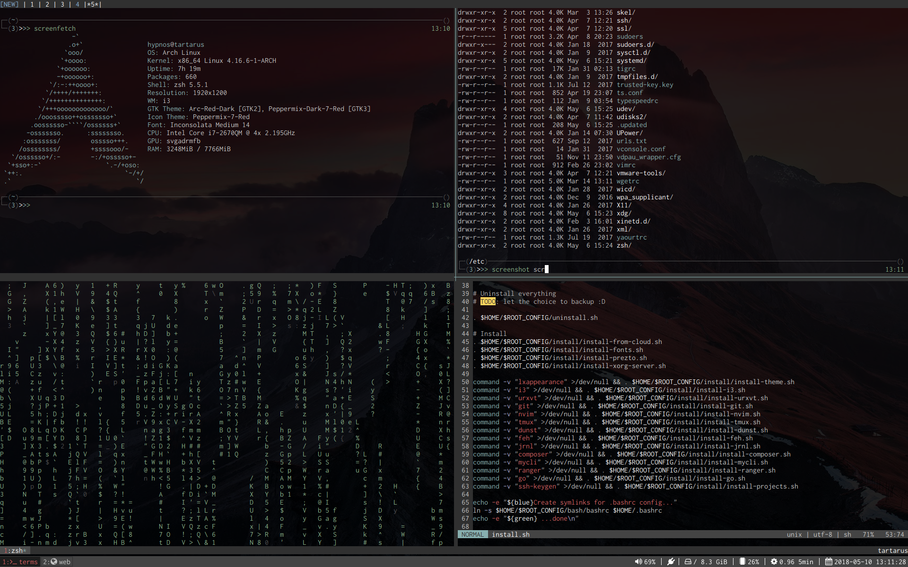

#  Doftiles

## What's in there?

My config for my development operating system.
I am using the lightweight and very effective combo:

* arch linux
* i3 / dmenu / dunst
* nvim
* tmux
* zsh / [fzf](https://github.com/junegunn/fzf) / [zprezto](https://github.com/sorin-ionescu/prezto)
* git / [tig](https://github.com/jonas/tig) / [diff-so-fancy](https://github.com/so-fancy/diff-so-fancy)

All my config files are in this repository except:
* My development project configurations
* My config install settings

Those files are private and are on my private cloud. You can use Dropbox or Nextcloud for yours.

## WARNING

There are no backup system for now, means if you install my config you will lose your own personnal config.
You shouldn't use the `install.sh` script. You should only pick whatever you want and include it in your own config.

## Install

If you don't have any config for any of the sotfware I list at the beginning of this file, you can run the install script.

You can install the whole config as following:
* Create your own install_config file. It should follow the install_config.dist rules.
* Run `sh install.sh` in your terminal

